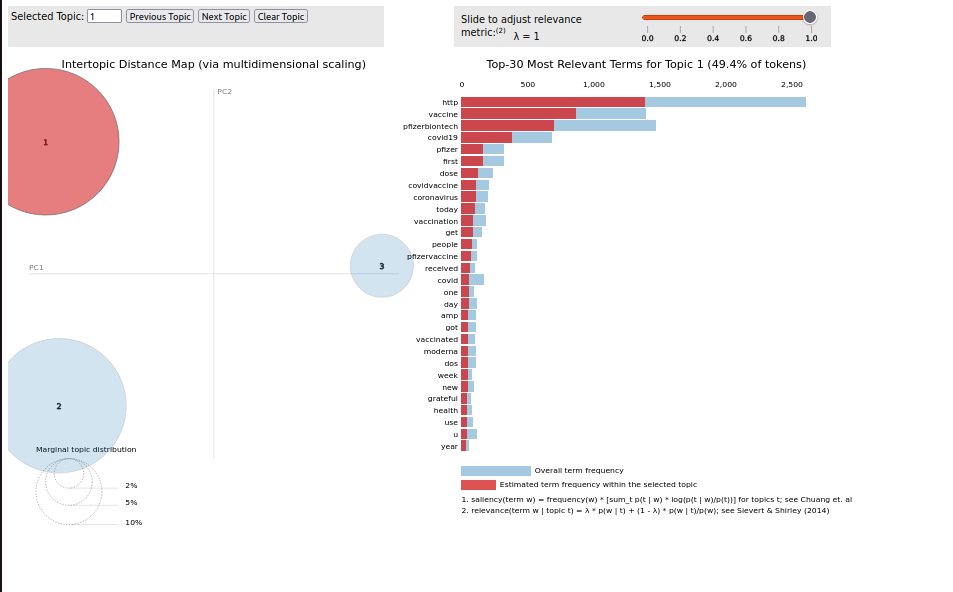

## Topic-based Extraction
This repo contains:

1. Methods for loading documents in various formats such as txt, csv, json, jsonl, and pdf.
2. Advanced preprocessing methods including handling numbers, word contractions, lowercasing, stopwords removal, lemmatization, etc.
3. Three methods for using Latent Dirichlet Allocation (LDA): BERTopic, a simple LDA with optimal number of topics found using coherence scores, and an LDA model build with GridSearch to automatically determine the best LDA model to use (recommanded).
4. Methods for visualizing the extracted topics (pyLDAVis, WorldCloud & BERTopic that got its own data viz)


## What is LDA: Latent Dirichlet Allocation

Latent Dirichlet Allocation (LDA) is a statistical model used in natural language processing (NLP) for topic modeling.
It assumes that documents are made up of topics, and each topic is a distribution over words. 
LDA aims to uncover these topics from a collection of documents by analyzing the co-occurrence patterns of words. 

It allows for automatic discovery of topics in a set of documents, making it a valuable tool for organizing and understanding large text corpora.
Latent Dirichlet Allocation is not a single-iteration algorithm. In the first iteration, the algorithm randomly assigns words to topics. It then goes through each word of each document and applies probability calculation formulas.

The process is then repeated through various iterations until the algorithm generates a set of topics and we obtain a satisfactory model.

## LDA Models

In order to compute LDA model using either coherence scores comparison either Gridsearch, I arbitrary chose to start with at least 3 topics and test all value until 30 with a step of 2.
It can of course be change within the code (check for method parameters), specially if you want a faster execution.

If no method argument is given while lauching this code, it will use GridSearchCV method.


## Installation & Usage

NOTE: Python 3.9 or higher is required.

```python

# create a venv
python -m venv lda

# install requirements
pip install -r requirements.txt

# usage
python lda.py <file_name> --method <method_name>

 # method_name must be in ["gridsearch", "bertopic", "coherence"] 
```

After this, a graphic will be saved as lda.html and cluster and key-word can be visualized in browser.


## Usage examples
```
python lda.py dissertation_en.pdf --method coherence

```

## Potential improvements

1. Add some english stopwords (will increase accuracy)
2. Multilingual support
3. Make it faster
4. Save the built model in order to be used again